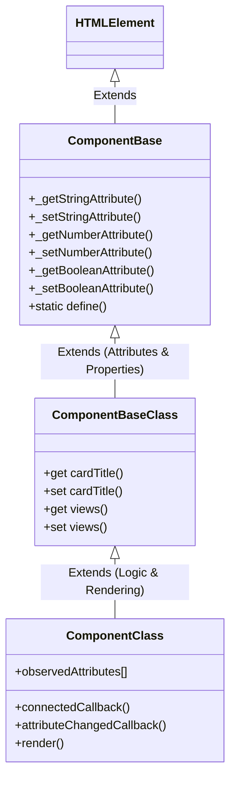

# ComponentBase & StyleSystem

A minimal, highly optimized, and robust base for building **Custom Elements** (Web Components) in JavaScript. This repository provides the foundation classes and style-system helpers used to implement, manage, and style all custom components consistently.

---

## Core Architecture Pattern: The Two-Tier Approach

To keep component logic clean, modular, and maintainable, this codebase recommends a **two-tier class structure** for every web component:



1. **The Base Class (Properties & Attributes)**
   * Extends `ComponentBase`.
   * **Responsibility**: Declares getters, setters, type validations, default values, and handles internal helper calls (e.g., `_getStringAttribute`, `_setBooleanAttribute`) for the component's attributes.
   * **No UI rendering**: It does not handle DOM creation or UI manipulation.

2. **The Main Class (Rendering & Logic)**
   * Extends the custom component's Base Class.
   * **Responsibility**: Specifies `observedAttributes`, handles the lifecycle methods (`connectedCallback`, `disconnectedCallback`, `attributeChangedCallback`), attaches event listeners, runs asynchronous operations, and renders content into the Shadow DOM.

---

## Features

### 1. Robust Attribute Accessors & Type Casting
`ComponentBase` provides robust helper methods to parse, set, and automatically validate attributes. Invalid actions trigger structured console warnings.

* **Strings**: Gets trimmed strings with optional custom validation.
* **Numbers**: Validates, handles `NaN`, and supports custom range validation.
* **Booleans**: Maps standard HTML attributes (where presence/absence indicates true/false) and parses `'true'`/`'false'` string values.

### 2. Powerful Style System (`StyleSystem`)
Allows encapsulation of CSS inside the Shadow Root using three style modes:
* **Adopted Stylesheets**: Uses browser native `adoptedStyleSheets` (`CSSStyleSheet` objects) for optimized style sharing.
* **External Stylesheet Links**: Loads stylesheet URLs via `<link>` elements and dispatches a `ready-links` event (adding a `ready-links` attribute to the host element) once loading finishes.
* **Raw CSS**: Injects string literal styles inside a `<style>` element.

---

## API Reference

### ComponentBase

#### `static define(tagName, styleSheets = {})`
Registers the custom element under the specified tag name and instantiates its stylesheet configuration.
* **`tagName`** *(string)*: Name of the element (e.g., `my-element`).
* **`styleSheets`** *(Object)*: Configuration containing `raw`, `links`, and `adopted` styles.

#### `_getStringAttribute(name, defaultValue = null, opt = {})`
Reads an attribute as a string.
* **`opt.trim`** *(boolean, default: true)*: Trims whitespace.
* **`opt.validate`** *(function)*: Return `true` if valid.

#### `_setStringAttribute(name, value, opt = {})`
Sets an attribute as a string (removes it if `value` is `null` or `undefined`).
* **`opt.validate`** *(function)*: Check logic before writing.
* **`opt.message`** *(string)*: Custom console warning on invalid value.

#### `_getNumberAttribute(name, defaultValue = NaN)`
Reads an attribute and parses it as a `Number`. Returns `defaultValue` if parsing yields `NaN`.

#### `_setNumberAttribute(name, value, opt = {})`
Sets a numeric attribute. Validates if input is a number first.

#### `_getBooleanAttribute(name, defaultValue = false)`
Evaluates attribute presence or boolean string representation (`"true"`/`"false"`).

#### `_setBooleanAttribute(name, value, opt = {})`
Controls the toggle state of a boolean attribute.

---

### StyleSystem

#### `StyleCollection`
A helper that extends `Set` logic to store unique stylesheet values. Supports an optional `validator` function and a value `mapper`.

#### `ComponentStyleSheets`
Maintains three separate `StyleCollection` fields for style encapsulation:
* **`adopted`**: `CSSStyleSheet` instances.
* **`links`**: External URL paths.
* **`raw`**: CSS rule string blocks.

#### `ComponentStyles`
Extends `ComponentStyleSheets`. It is bound to an element instance. When `apply()` is called:
1. It creates a `.styles` shadow container.
2. Appends link stylesheets, triggering a `ready-links` event on the host upon load completion.
3. Appends raw CSS `<style>` elements.
4. Updates `adoptedStyleSheets` on the element's Shadow Root.

---

## Example Usage

Here is a full example showing how to build a custom card element using this architecture.

### 1. The Properties Layer: `CustomCardBase.js`

```javascript
import { ComponentBase } from "./ComponentBase.js";

export class CustomCardBase extends ComponentBase {
    static defaults = {
        title: "Default Title",
        views: 0,
        featured: false
    };

    // --- Attributes: String ---
    get cardTitle() {
        return this._getStringAttribute("card-title", this.constructor.defaults.title);
    }
    set cardTitle(value) {
        this._setStringAttribute("card-title", value);
    }

    // --- Attributes: Number ---
    get views() {
        return this._getNumberAttribute("views", this.constructor.defaults.views);
    }
    set views(value) {
        this._setNumberAttribute("views", value, {
            validate: (num) => num >= 0,
            message: "Views must be a positive number."
        });
    }

    // --- Attributes: Boolean ---
    get featured() {
        return this._getBooleanAttribute("featured", this.constructor.defaults.featured);
    }
    set featured(value) {
        this._setBooleanAttribute("featured", value);
    }
}
```

### 2. The Logic & Rendering Layer: `CustomCard.js`

```javascript
import { CustomCardBase } from "./CustomCardBase.js";

export class CustomCard extends CustomCardBase {
    static DEFAULT_TAG_NAME = "custom-card";

    // Specify which attributes trigger attributeChangedCallback
    static observedAttributes = ["card-title", "views", "featured"];

    #connected = false;

    constructor() {
        super();
    }

    connectedCallback() {
        this.#connected = true;
        this.render();
    }

    attributeChangedCallback(name, oldValue, newValue) {
        if (!this.#connected || oldValue === newValue) return;
        
        // Simple update: re-render the card body on attribute change
        this.render();
    }

    render() {
        const cardBody = this.shadowRoot.querySelector(".card-body") || document.createElement("div");
        cardBody.className = `card-body ${this.featured ? "featured" : ""}`;
        
        cardBody.innerHTML = `
            <h3>${this.cardTitle}</h3>
            <p>Total Views: <strong>${this.views}</strong></p>
        `;
        
        if (!cardBody.parentElement) {
            this.shadowRoot.append(cardBody);
        }
    }
}

// Define the element with its raw styles
CustomCard.define(CustomCard.DEFAULT_TAG_NAME, {
    raw: `
        .card-body {
            font-family: 'Segoe UI', Roboto, sans-serif;
            padding: 1.5rem;
            border: 1px solid #e2e8f0;
            border-radius: 8px;
            background: #ffffff;
            transition: all 0.2s ease;
        }
        .featured {
            border-color: #f59e0b;
            background: #fffbeb;
            box-shadow: 0 4px 6px -1px rgba(245, 158, 11, 0.1);
        }
        h3 {
            margin: 0 0 0.5rem 0;
            color: #1e293b;
        }
        p {
            margin: 0;
            color: #64748b;
        }
    `
});
```